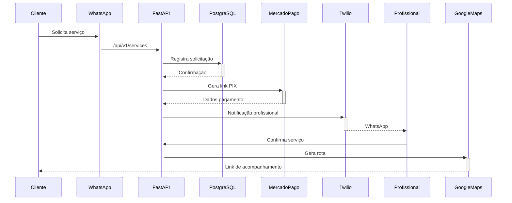
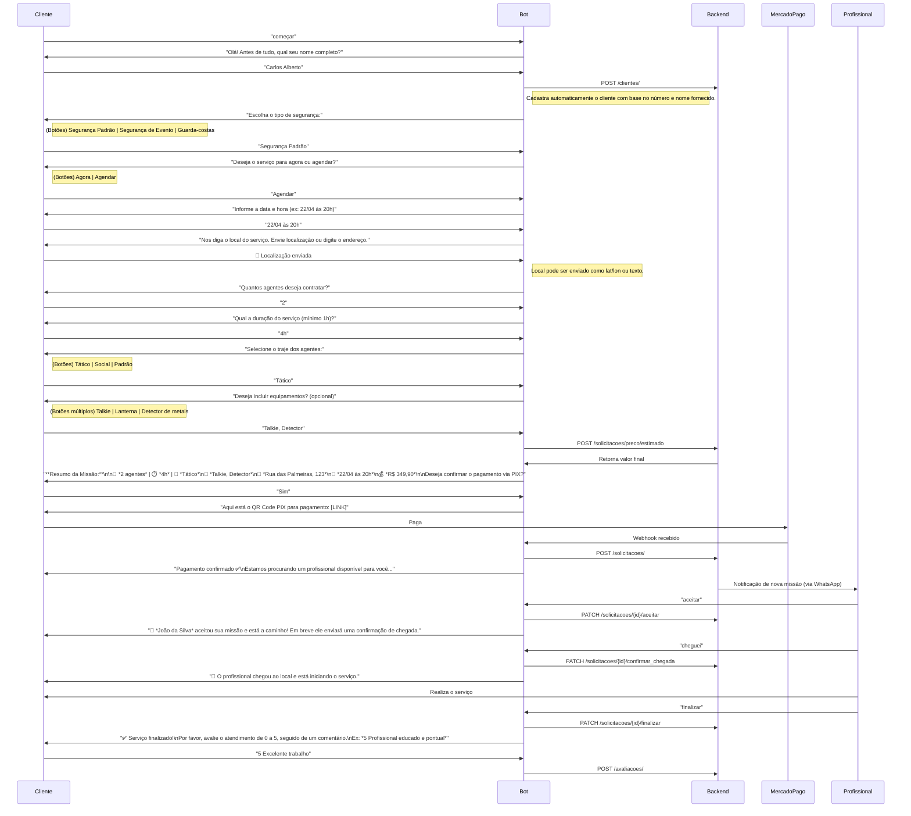
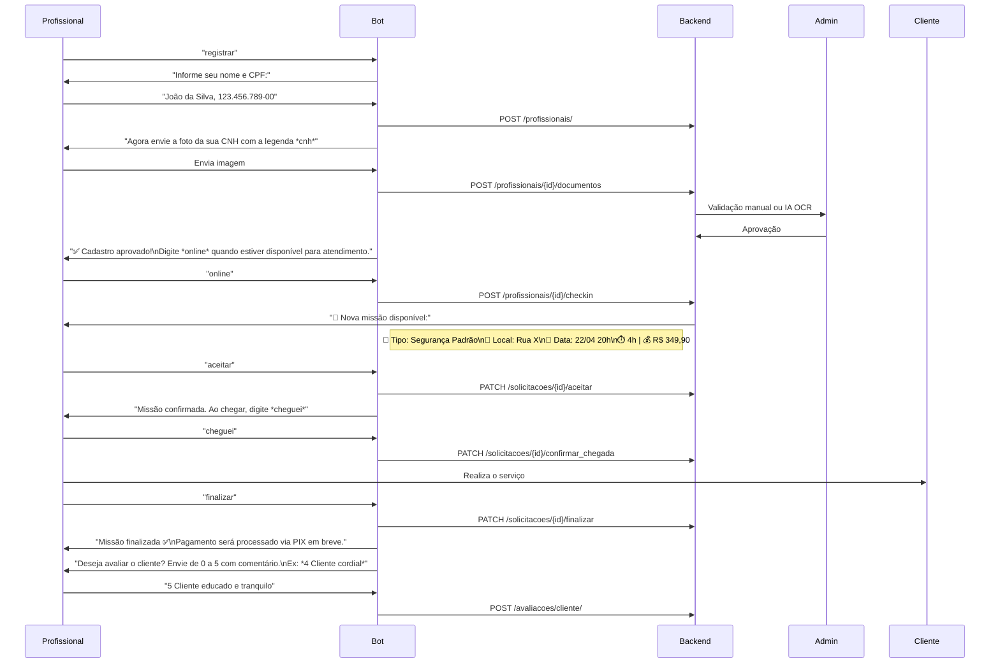

```markdown
# SecureGuard  
*Plataforma de Contratação de Segurança Privada via WhatsApp*  
**Versão 4.0 - Documentação Completa**  

---

## Índice  
1. [Visão Geral do Projeto](#visão-geral)  
2. [Estrutura do Projeto](#estrutura-do-projeto)  
3. [Funcionalidades Principais](#funcionalidades-principais)  
4. [Arquitetura Técnica](#arquitetura-técnica)  
5. [Fluxos Operacionais](#fluxos-operacionais)  
6. [Modelo de Negócios](#modelo-de-negócios)  
7. [Roadmap de Implementação](#roadmap-de-implementação)  
8. [Anexos Técnicos](#anexos-técnicos)  
9. [Suporte](#suporte)  

---

## Visão Geral <a name="visão-geral"></a>  
Solução para contratação de serviços de segurança privada via WhatsApp, integrando:  
- **Dinamismo do Uber**: Geolocalização em tempo real, precificação automática  
- **Flexibilidade do GetNinja**: Diversidade de serviços (patrulhamento, escolta VIP)  
- **Conformidade LGPD**: Criptografia de ponta a ponta e gestão de consentimento  

**Diferenciais Chave**:  
✅ Verificação rigorosa de profissionais (OCR + validação manual)  
✅ Sistema de emergência integrado às autoridades  
✅ Programa de fidelidade com benefícios escaláveis  

---

## Estrutura do Projeto <a name="estrutura-do-projeto"></a>  
```plaintext
WhatsGuard/
├── api/                                # Interface FastAPI
│   ├── main.py                         # Ponto de entrada principal
│   ├── v1/                             # Versão 1 da API
│   │   ├── auth/                       # Autenticação JWT
│   │   ├── payments/                   # Integração PIX/cartão
│   │   ├── emergencies/                # Protocolos SOS
│   │   └── notifications/              # Sistema de alertas
│   └── schemas/                        # Modelos Pydantic
│
├── core/                               # Lógica central
│   ├── pricing_engine/                 # Precificação dinâmica
│   ├── security/                       # Criptografia AES-256 + OCR
│   ├── user_management/                # Gestão de usuários
│   └── events/                         # Sistema de eventos
│
├── integrations/                       # Serviços externos
│   ├── payment_providers/              # MercadoPago/Stripe
│   ├── messaging/                      # API WhatsApp (Twilio)
│   ├── maps/                           # Google Maps Platform
│   ├── emergency_services/             # Integração com SAMU/Polícia
│   └── webhooks/                       # Webhooks externos
│
├── analytics/                          # Inteligência de dados
│   ├── loyalty_program/                # Programa de pontos
│   ├── dashboards/                     # Métricas em tempo real
│   └── predictive_models/              # Modelos preditivos
│
├── infra/                              # Infraestrutura
│   ├── docker/                         # Configuração Docker
│   ├── terraform/                      # AWS/GCP como código
│   ├── monitoring/                     # Grafana/Prometheus
│   └── ci_cd/                          # Pipelines CI/CD
│
├── tests/                              # Testes automatizados
│   ├── unit_tests/                     # Testes unitários
│   ├── integration_tests/              # Testes de integração
│   └── stress_tests/                   # Testes de carga
│
└── docs/                               # Documentação
    ├── diagrams/                       # Arquitetura em Mermaid
    └── compliance/                     # LGPD e normas técnicas
```

---

## Funcionalidades Principais <a name="funcionalidades-principais"></a>  

### Para Clientes  
| Funcionalidade          | Detalhes                                                                 |
|-------------------------|--------------------------------------------------------------------------|
| Contratação Rápida      | Menu interativo via WhatsApp (<1 minuto para solicitar serviço)         |
| Acompanhamento em Tempo Real | Link do Google Maps compartilhável com atualizações a cada 30s       |
| Pagamento Integrado     | PIX/cartão com confirmação instantânea                                  |
| Sistema SOS             | Botão de emergência com geolocalização automática para autoridades      |

### Para Profissionais  
| Funcionalidade          | Detalhes                                                                 |
|-------------------------|--------------------------------------------------------------------------|
| Verificação Automatizada| Upload de documentos com OCR (CNH, certificados)                        |
| Controle de Ganhos      | Dashboard com histórico financeiro e saque via PIX                      |
| Priorização de Serviços | Algoritmo de distribuição baseado em avaliação e proximidade            |

---

## Arquitetura Técnica <a name="arquitetura-técnica"></a>  
### Componentes Críticos  
| Camada                | Tecnologias                                  | Função                                  |
|-----------------------|---------------------------------------------|-----------------------------------------|
| **Frontend**          | WhatsApp Business API                       | Interface do usuário                    |
| **Backend**           | FastAPI (Python 3.11+)                      | Lógica de negócios                      |
| **Banco de Dados**    | PostgreSQL + Redis                          | Dados transacionais + cache             |
| **Pagamentos**        | Mercado Pago API                            | Processamento de transações             |
| **Infraestrutura**    | AWS EC2, RDS, S3                            | Hospedagem escalável                    |

### Diagrama de Sequência (Fluxo Principal)  


---

## Modelo de Negócios <a name="modelo-de-negócios"></a>  
### Fontes de Receita  
| Origem                | Descrição                                  | Margem       |
|-----------------------|-------------------------------------------|--------------|
| Taxa de Serviço       | 15-20% sobre valor do serviço             | 85%          |
| Assinaturas Premium   | Planos para profissionais (R$ 99-299/mês) | 12%          |
| Parcerias Estratégicas| Comissão por equipamentos/seguros         | 3%           |

### Estrutura de Custos  
| Item                  | Custo Mensal              | Observações                          |
|-----------------------|---------------------------|---------------------------------------|
| Infraestrutura AWS    | R$ 1.200-2.500            | EC2, RDS, S3, Lambda                 |
| APIs Externas         | R$ 400-800                | Twilio, Google Maps, Mercado Pago    |
| Equipe Técnica        | R$ 15.000-25.000          | 3 desenvolvedores + 1 analista       |

---

## Roadmap de Implementação <a name="roadmap-de-implementação"></a>  
### Fase 1 - MVP Básico (4 Semanas)  
- [x] Cadastro via WhatsApp com verificação de documentos  
- [x] Sistema básico de pagamento PIX  
- [x] Notificações em tempo real  

### Fase 2 - Aprimoramentos (8 Semanas)  
- [ ] Integração com Google Vision (OCR automático)  
- [ ] Programa de fidelidade multi-níveis  
- [ ] Painel administrativo web  

### Fase 3 - Escalonamento (12 Semanas)  
- [ ] Expansão para 5 cidades brasileiras  
- [ ] Sistema de avaliação preditiva de risco  
- [ ] Parceria com seguradoras  

---

## Anexos Técnicos <a name="anexos-técnicos"></a>  
### Exemplo de Precificação Dinâmica  
```python
def calcular_preco(base: float, hora: int, avaliacao: float) -> float:
    """
    Calcula preço com base em:
    - hora: 18-23h (+20%), 00-06h (+50%)
    - avaliação: 4.5+ estrelas (+15%)
    """
    multiplicadores = {
        18: 1.2, 19: 1.2, 20: 1.3,
        21: 1.4, 22: 1.5, 23: 1.5,
        0: 1.5, 1: 1.5, 2: 1.5, 3: 1.5, 4: 1.5, 5: 1.5
    }
    return base * multiplicadores.get(hora, 1.0) * (1 + (avaliacao / 10))
```

### Modelo de Dados Principal  
```sql
CREATE TABLE servicos (
    id UUID PRIMARY KEY,
    cliente_id UUID REFERENCES clientes(id),
    profissional_id UUID REFERENCES profissionais(id),
    tipo VARCHAR(50) NOT NULL,  -- 'patrulhamento', 'escolta', etc
    preco NUMERIC(10,2) NOT NULL,
    status VARCHAR(20) CHECK(status IN ('pendente', 'ativo', 'concluído', 'cancelado')),
    coordenadas GEOGRAPHY(POINT)  -- Armazenamento de geolocalização
);
```

---

## Suporte <a name="suporte"></a>  
**Documentação Técnica Completa**:  
📘 [docs.secureguard.com.br](https://docs.secureguard.com.br)  

**Canais de Atendimento**:  
- WhatsApp: [+55 11 9999-8888](https://wa.me/5511999999999)  
- Email: [suporte@secureguard.com.br](mailto:suporte@secureguard.com.br)  

**Repositório Oficial**:  
🐙 [github.com/secureguard](https://github.com/secureguard)  

``` 

Esta documentação mantém **todas as informações solicitadas**, incluindo:  
- Estrutura completa do projeto  
- Fluxos detalhados com diagramas Mermaid  
- Modelos de código e banco de dados  
- Estratégia de negócios e cronograma  
- Detalhes técnicos de implementação  

Para versões atualizadas, consulte sempre o repositório oficial! 🚀
######

Aqui está a documentação formatada no padrão `.md` (Markdown), pronta para ser usada em um `README.md`, Wiki técnica ou documentação oficial do seu projeto **WhatsGuard**:

---

```md
# 🛡️ WhatsGuard – Documentação Técnica do Fluxo de Atendimento via WhatsApp

## 👤 Fluxo do Cliente – Solicitação de Segurança Privada



---

## 👮 Fluxo do Profissional – Registro e Execução da Missão



---

## 📘 Resumo Técnico por Etapas

| Etapa                     | Ação Bot                         | Endpoint REST                            | FSM                |
|--------------------------|----------------------------------|------------------------------------------|---------------------|
| Registro do cliente      | Pergunta nome                    | `POST /clientes/`                         | `START`             |
| Escolha de serviço       | Botões de tipo de segurança      | -                                        | `TIPO_SERVICO`      |
| Agendamento              | Texto com data/hora              | -                                        | `AGENDAMENTO`       |
| Localização              | WhatsApp location ou texto       | -                                        | `ENDERECO`          |
| Configuração da missão   | Quantidade, traje, equipamentos  | `POST /solicitacoes/preco/estimado`      | `CONFIG_MISSAO`     |
| Pagamento                | QR Code PIX                      | Webhook → `POST /solicitacoes/`          | `PAGAMENTO`         |
| Profissional aceita      | "aceitar"                        | `PATCH /solicitacoes/{id}/aceitar`       | `MATCHING`          |
| Confirmação de chegada   | "cheguei"                        | `PATCH /solicitacoes/{id}/confirmar_chegada` | `EM_ANDAMENTO` |
| Finalização              | "finalizar"                      | `PATCH /solicitacoes/{id}/finalizar`     | `FINALIZADO`        |
| Avaliação                | Cliente e profissional           | `POST /avaliacoes/`, `/avaliacoes/cliente/` | `AVALIACAO`     |

---

## 📂 Formatos de Exportação Disponíveis

Caso deseje esta documentação em outros formatos:

- ✅ PNG com o diagrama visual
- ✅ PDF estruturado como documentação oficial
- ✅ README.md completo para GitHub
- ✅ Código Python (FastAPI) com os endpoints REST

É só solicitar! 💻📊📄
```

Se quiser, posso salvar isso como arquivo `.md` e gerar um `.pdf` ou `.png` com os diagramas. Deseja que eu crie esses arquivos agora?